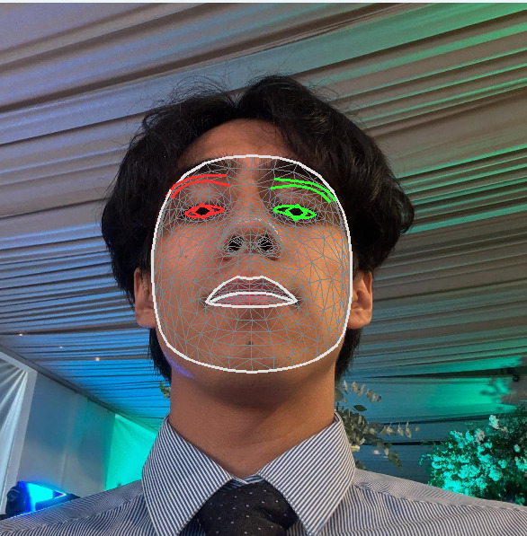
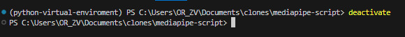
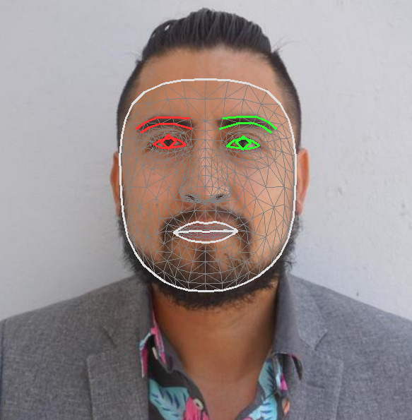

# Script para la instalación de MediaPipe con un entorno virtual de python
MediaPipe Solutions proporciona un paquete de bibliotecas y herramientas para que apliques rápidamente técnicas de inteligencia artificial (IA) y aprendizaje automático (AA) en tus aplicaciones. Puedes conectar estas soluciones a tus aplicaciones de inmediato, personalizarlas según tus necesidades y usarlas en varias plataformas de desarrollo. 

La tarea de MediaPipe Face Landmarker te permite detectar puntos de referencia faciales y expresiones faciales en imágenes y videos. Puedes usar esta tarea para identificar expresiones faciales humanas y aplicar filtros y efectos faciales para crear un avatar virtual. En esta tarea, se usan modelos de aprendizaje automático (AA) que pueden funcionar con imágenes individuales o una transmisión continua de imágenes. La tarea genera puntos de referencia faciales en 3 dimensiones, puntuaciones de formas de combinación (coeficientes que representan la expresión facial) para inferir superficies faciales detalladas en tiempo real y matrices de transformación para realizar las transformaciones necesarias para la renderización de efectos.



Para realizar la demostración del uso de la libreria de Mediapipe en Python, se escribio un programa con el lenguaje ya previamente mencionado. Este programa trata de predecir todos los rostros que se encuentren en las imagenes que nosotros le proporcionamos en una carpeta. Ya con los rostros detectados, trata de predecir, con un modelo de aprendizaje todos los puntos que pueda encontrar en dichas caras, para que al final nos de un resultado de todas las caras que logro detectar y una malla verde que fueron todos los puntos que detecto el programa con su modelo de aprendizaje precargado.

También se creo un script donde este se encarga de la instalación por completo de las herramientas que necesita Python para ejecutar el programa en culquier computadora. Este script puede ser encontrado en la carpeta raiz del proyecto mismo, con el nombre `run`. Este archivo cuenta con dos extensiones, `bash` y `ps1`. Esto fue con la idea de que el script pueda ser ejecutado en sistemas operativos tipo **Unix** o en **Windows**.

De esta manera podemos verificar la efectividad de mediapipe como herramienta y con el uso de OpenCV para proyectos futuros relacionados a visión por computadora.

# Instalación
Para que se pueda realizar la demostración del programa con mediapipe deberas ejecutar el script `run` antes mencionado. La extensión debe ser elegida dependiendo de tu sistema operativo donde se haya descargado el proyecto.

### Windows
Si te encuentras en el sistemas operativo Windows 11, debes ejecutar el archivo `run.ps1` en la terminal de PowerShell. Es necesario seguir el siguiente tutorial:


El proposito de seguir el anterior tutorial es porque el script necesita de una instalación personalizada de Python, para no afectar la versión de Python que se encuentra actualmente instalada en tu sistema operativo.

### MacOS o Linux
Si te encuentras en el sistema operativo MacOS o cualquier distribución de Linux, deberas ejecutar el archivo `run.bash` en tu terminal de preferencia.

No es necesario seguir el anterior video, el script realiza la instalación de Python de forma autómatica.

Es importante saber que, el programa hace uso de fotos precargadas para la demostración y detección de rostros, caso en que requiera que sean diferentes rostros o imagenes diferentes, debera ingresar estas fotos en la carpeta `images`, dentro de esta carpeta el programa detectara todas las imagenes ah analizar y le ira mostrando todos los resultados uno por uno.

## Al finalizar la instalación
Es necesario recalcar que el script realiza la instalación de todo lo que el programa necesita para poder ejecutarse, así que este no requiere de librerias importantes en nuestras computadoras. Puede borrar el contenido de la carpeta de `python-3.11`, al igual que del archivo `tgz`, sin problema alguno, esto porque trabajan de forma independiente y ningun otro programa depende de su existencía.

Si la terminal donde ejecuto cualquiera de los scripts anteriores muestra una de las dos siguientes leyendas:

### Unix

En el caso de ser **MacOS** o **Linux**, ingrese el siguiente comando:


```bash
$ deactivate
```

### Windows

En el caso de Windows, ingrese el siguiente comando:

```cmd
$ deactivate
```



# Explicación
Dentro del archivo `main.py` se pueden encontrar la lógica que se sigio para la detección de rostros con el uso de MediaPipe. Primero el codigo trata de definir las rutas de imagenes para a detectar.

```python
file_path = os.getcwd() + os.sep + 'images'
IMAGE_ARRAY = os.listdir(file_path)
```

Al tener todas las imagenes, va a empezar a iterar por cada imagen detectada y con OpenCV obtener la información en una matriz para poder trabajar con toda esta información. OpenCV trabaja con la escala BGR pero MediaPipe trabaja con RGB, para esto vamos a cambiar esta escala a RGB para poder usar Mediapipe.

```python
CURRENT_IMAGE = cv2.cvtColor(CURRENT_IMAGE, cv2.COLOR_BGR2RGB)
```

Ya en la escala correcta de colores, empezaremos a usar la funcion `FaceMesh`. Esta función se va a encargar de analizar la matriz generada por OpenCV y encontrar los puntos importantes en esta matriz previamente creada. 

```python
from mediapipe import solutions

mp_face_mesh = solutions.face_mesh
results = mp_face_mesh.FaceMesh(max_num_faces=2, refine_landmarks=True).process(CURRENT_IMAGE)
```
Para poder empezar y demostrar los resultados, anteriormente se había explicado que OpenCV trabaja con BGR y MediaPipe con RGB, tenemos que realizar de nuevo este cambio para poder continuar.

```python
CURRENT_IMAGE = cv2.cvtColor(CURRENT_IMAGE, cv2.COLOR_RGB2BGR)
```

Ya con toda la información recaudada y la matriz de OpenCV en su estado original de colores, vamos a iterar por cada punto encontrado con MediaPipe y dibujar en la posición dada en la matriz creada por OpenCV, para esto vamos a usar `draw_landmarks`. Esta función requiere de varios parametros, pero hay dos que vamos a destacar y son `connections` y `connection_drawing_spec`. Estos dos parametros se van a encargar de decidir que rasgos faciales va a dibujar MediaPipe en la matriz.

```python
mp_drawing.draw_landmarks(
  image=CURRENT_IMAGE, 
  landmark_list=face_landmarks, 
  connections=mp_face_mesh.FACEMESH_TESSELATION,
  landmark_drawing_spec=None,
  connection_drawing_spec=mp_drawing_styles.get_default_face_mesh_tesselation_style()
)
```

Para terminar, mostramos los datos con `imshow()` de OpenCV dandonos un resultado como el siguiente:

